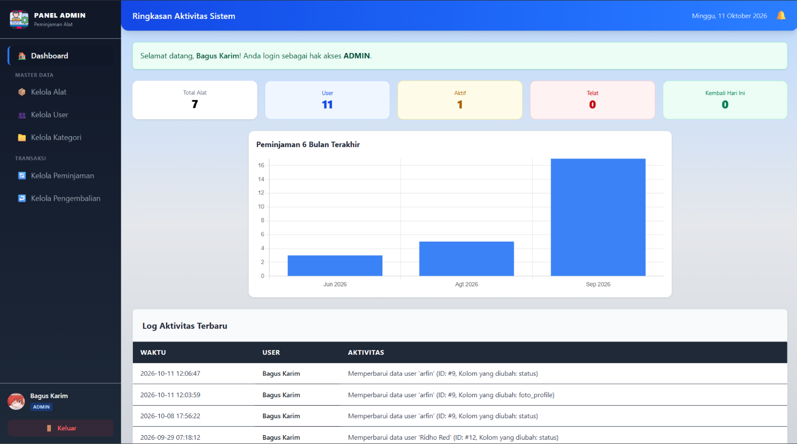
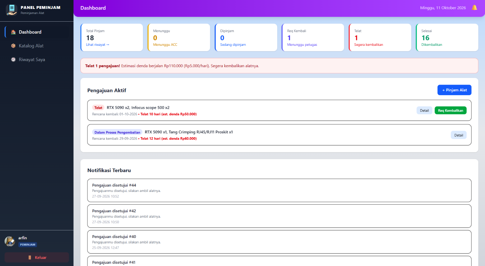
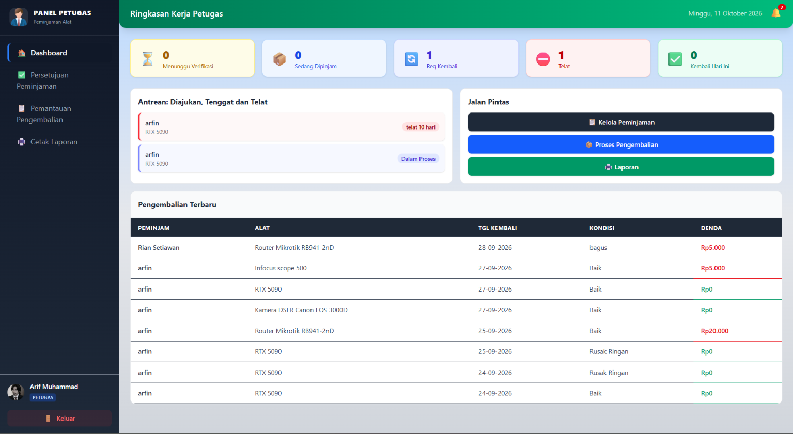

# 🏫 Sistem Peminjaman Alat - SMKN 7

[](https://laravel.com)
[](https://php.net)
[](https://mysql.com)
[](https://docker.com)
[](https://web.dev/offline/)

> **Sistem manajemen peminjaman alat laboratorium berbasis web** untuk SMKN 7 dengan arsitektur **offline-first**, multi-role (Admin, Petugas, Peminjam), dan workflow lengkap dari pengajuan hingga pengembalian dengan perhitungan denda otomatis.

---

## 📸 **Screenshots**

> *Preview dari aplikasi*

| Dashboard Admin | Dashboard Peminjam | Dashboard Petugas |
|:---:|:---:|:---:|
|  |  |  |

---

## ✨ **Fitur Utama**

### 👥 **Multi-Role System (RBAC)**
| Role | Hak Akses |
|------|-----------|
| **Admin** | Full CRUD: User, Kategori, Alat, Peminjaman, Pengembalian, Laporan, Notifikasi |
| **Petugas** | Approve/Tolak pinjam, Proses kembali, Denda, ReqEdit, Laporan PDF/Excel |
| **Peminjam** | Katalog alat, Ajukan pinjam, Riwayat, Edit pinjam (status diajukan), Request kembali |

### 🔄 **Workflow Peminjaman Lengkap**
```
Diajukan → Disetujui (Stok -1) → Dipinjam → Request Kembali → Proses Kembali (Stok +1, Hitung Denda) → Dikembalikan/Telat
```

### 💰 **Sistem Denda Otomatis**
| Kondisi Kembali | Denda |
|----------------|-------|
| Baik | Rp 0 (kecuali telat) |
| Rusak Ringan | Denda ringan + stok normal |
| Rusak Berat | Denda besar + stok -1 |
| Hilang | Denda full harga + stok -1 permanen |

### 🔔 **Notifikasi Real-time**
- SweetAlert2 Toast (auto-close 4-6 detik)
- Dropdown notifikasi di header
- Mark all as read
- Auto-refresh badge count

### 📊 **Laporan & Ekspor**
- **PDF** (DomPDF) - Template resmi dengan header instansi
- **Excel** (Laravel-Excel) - Data mentah untuk analisis
- Filter: Tanggal, Status, Kategori

### 🔒 **Keamanan & Validasi**
- Role-based middleware (`admin`, `petugas`, `peminjam`)
- Self-protection (admin gak bisa hapus/nonaktifkan diri sendiri)
- User status middleware (auto-logout user nonaktif)
- Soft delete dengan audit trail
- CSRF + Form Request validation

---

## 🛠️ **Tech Stack**

| Layer | Technology |
|-------|------------|
| **Backend** | Laravel 12.x, PHP 8.2+ |
| **Database** | MySQL 8.0 |
| **Frontend** | Blade Templates + Alpine.js 3.x |
| **Styling** | TailwindCSS 3.x (Compiled) |
| **Charts** | Chart.js 4.x |
| **Animations** | AOS (Animate On Scroll) |
| **Modals/Alerts** | SweetAlert2 |
| **PDF Export** | DomPDF (barryvdh/laravel-dompdf) |
| **Excel Export** | Laravel-Excel (maatwebsite/excel) |
| **Auth** | Laravel Session + Sanctum |
| **Container** | Docker Compose |

---

## 📦 **Offline-First Architecture**

Semua assets **100% lokal** - tidak butuh internet/CDN:

```
public/vendor/
├── tailwindcss/          # TailwindCSS compiler (binary)
├── alpinejs/             # Alpine.js v3
├── aos/                  # Animate On Scroll
├── sweetalert2/          # Beautiful alerts
└── chartjs/              # Chart.js v4
```

**CSS/JS sudah di-compile:**
- `public/css/app.css` - Tailwind compiled
- `public/js/app.js` - Alpine compiled

> **Download assets:** `./download-offline-assets.sh`

---

## 🐳 **Docker Deployment (Recommended)**

```yaml
# docker-compose.yml - 3 Services
services:
  mysql-server:    # Port 3306
  app-laravel:     # Port 8000
  phpmyadmin:      # Port 8081
```

### **Quick Start**
```bash
# 1. Clone & setup
git clone https://github.com/FinSensei/peminjaman_alat-smkn7.git
cd peminjaman_alat-smkn7

# 2. Start containers
docker-compose up -d

# 3. Setup Laravel (first time)
cd backend
composer install
cp .env.example .env
# Edit .env dengan DB credentials
php artisan key:generate
php artisan migrate --seed
php artisan storage:link

# 4. Akses aplikasi
# App: http://localhost:8000
# phpMyAdmin: http://localhost:8081
```

### **Manual Setup (Tanpa Docker)**
```bash
cd backend
composer install
cp .env.example .env
# Edit .env: DB_HOST=127.0.0.1, DB_DATABASE=laravel, dll
php artisan key:generate
php artisan migrate --seed
php artisan storage:link
php artisan serve --host=0.0.0.0 --port=8000
```

---

## 🔑 **Demo Accounts**

| Role | Email | Password |
|------|-------|----------|
| **Admin** | admin@gmail.com | admin123 |
| **Petugas** | petugas@gmail.com | petugas123 |
| **Peminjam** | rian@gmail.com | siswa123 |

---

## 📁 **Project Structure**

```
backend/
├── app/
│   ├── Console/Commands/          # AutoCancelReqKembali, TandaiTelat
│   ├── Exports/LaporanExport.php  # Excel export
│   ├── Http/
│   │   ├── Controllers/
│   │   │   ├── AdminController.php      # CRUD monolith (671 lines)
│   │   │   ├── AuthController.php
│   │   │   ├── PeminjamController.php
│   │   │   ├── PetugasController.php
│   │   │   └── API/                     # 9 API Controllers
│   │   ├── Middleware/                  # CheckRole, CheckUserStatus
│   │   ├── Requests/                    # Form Request validation
│   │   └── Resources/                   # API Resources
│   ├── Models/                        # 7 Models + Relationships
│   ├── Observers/                     # 5 Observers (Log Aktivitas)
│   └── Providers/AppServiceProvider.php
├── bootstrap/app.php                   # Middleware registration
├── config/
├── database/
│   ├── migrations/                    # 14 migration files
│   └── seeders/UserSeeder.php
├── public/
│   ├── css/app.css                    # Compiled Tailwind
│   ├── js/app.js                      # Compiled Alpine
│   └── vendor/                        # OFFLINE ASSETS
├── resources/
│   ├── views/
│   │   ├── layouts/app.blade.php      # Main layout + Alpine + AOS + SweetAlert2
│   │   ├── admin/                     # 15+ views
│   │   ├── peminjam/                  # 5 views
│   │   ├── petugas/                   # 6 views
│   │   └── auth/login.blade.php
│   ├── css/app.css                    # Source Tailwind
│   └── js/app.js                      # Source Alpine
├── routes/
│   ├── web.php                        # 130 lines - Web routes
│   ├── api.php                        # API routes
│   └── console.php                    # Scheduler (hourly)
└── docker-compose.yml
```

---

## 🔌 **API Endpoints**

| Resource | Endpoints |
|----------|-----------|
| **Auth** | `POST /api/login`, `POST /api/logout`, `GET /api/user` |
| **Alat** | `GET /api/alat`, `GET /api/alat/{id}`, `GET /api/katalog` |
| **Kategori** | `GET /api/kategori` |
| **Peminjaman** | `GET /api/peminjaman`, `POST /api/peminjaman`, `PUT /api/peminjaman/{id}` |
| **Pengembalian** | `GET /api/pengembalian`, `POST /api/pengembalian` |
| **User** | `GET /api/user`, `GET /api/user/{id}` |
| **Laporan** | `GET /api/laporan` |
| **Log** | `GET /api/log-aktivitas` |

---

## ⚙️ **Configuration**

### **Environment Variables (.env) example**
```env
APP_NAME="Sistem Peminjaman Alat"
APP_ENV=production
APP_DEBUG=false
APP_URL=http://localhost:8000

DB_CONNECTION=mysql
DB_HOST=mysql-server
DB_PORT=3306
DB_DATABASE=PINJAM_alat
DB_USERNAME=pinjam_alat
DB_PASSWORD=pinjam_alat

# Denda per hari (config/inventory.php)
DENDA_PER_HARI=5000
```

### **Scheduler (routes/console.php)**
```php
Schedule::command('peminjaman:auto-cancel-req-kembali')->hourly();
Schedule::command('peminjaman:tandai-telat')->hourly();
```

---

## 🧪 **Testing**

```bash
# Run tests
cd backend
php artisan test

# Run specific test
php artisan test --filter=PeminjamanTest
```

---

## 📈 **Roadmap**

- [ ] Refactor AdminController → Resource Controllers
- [ ] Service Layer (StokService, DendaService)
- [ ] Unit/Feature Tests (Pest/PHPUnit)
- [ ] Redis Queue untuk notifikasi
- [ ] Redis Cache untuk dashboard analytics
- [ ] PWA Support (Service Worker + Manifest)
- [ ] QR Code Scanner untuk check-in/out
- [ ] Email Notifications (SMTP/Mailgun)
- [ ] Multi-language (i18n)

---

## 🤝 **Contributing**

1. Fork repository
2. Create feature branch (`git checkout -b feature/nama-fitur`)
3. Commit changes (`git commit -m 'feat: tambah fitur X'`)
4. Push to branch (`git push origin feature/nama-fitur`)
5. Open Pull Request

---

## 📄 **License**

MIT License - lihat file [LICENSE](LICENSE) untuk detail.

---

## 👨‍💻 **Author**

**Muhamad Arfin** - *Developer*
- GitHub: [@FinSensei](https://github.com/FinSensei)
- Repository: [peminjaman_alat-smkn7](https://github.com/FinSensei/peminjaman_alat-smkn7)

---

## 🙏 **Acknowledgments**

- Laravel Framework Team
- TailwindCSS Team
- Alpine.js Team
- Chart.js Team
- SweetAlert2 Team
- AOS Library
- DomPDF & Laravel-Excel Contributors

---

<div align="center">

**⭐ Star this repo if you find it useful!**

Made with ❤️ for SMKN 7

</div>
